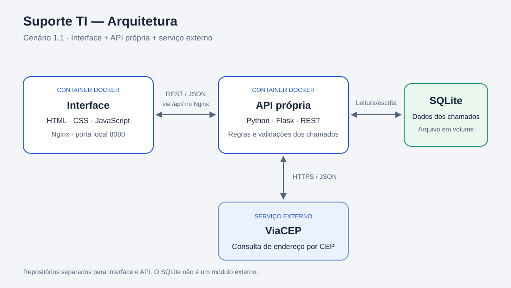

# Suporte TI — Interface

Interface web para gerenciamento de chamados de suporte presencial de TI,
desenvolvida como parte do MVP da pós-graduação em Engenharia de Software.

A proposta permite registrar problemas, acompanhar o andamento dos
atendimentos e consultar o endereço do local por meio do CEP.

## Estado atual

Interface e back-end executam em containers Docker separados.

Foram verificados manualmente o cadastro, a listagem, a edição,
a exclusão, os filtros e os contadores pela interface.

Também foi verificada a permanência de um chamado após reiniciar
o container do back-end.

A revisão final inclui os casos de erro e a execução a partir
dos arquivos publicados.

Repositório do back-end:
https://github.com/kaiov320-prog/suporte-ti-api-MVP3

## Funcionalidades

- Formulário de cadastro e edição de chamados.
- Listagem de chamados em cards.
- Exclusão com confirmação.
- Status: aberto, em atendimento e concluído.
- Classificação por categoria e prioridade.
- Filtros por status e prioridade.
- Contadores gerais por status, independentes dos filtros.
- Consulta de endereço por CEP por meio do back-end.
- Mensagens de sucesso, erro e carregamento.
- Layout responsivo.

Os chamados são persistidos pelo back-end no SQLite.
A interface não utiliza armazenamento local como banco de dados.

## Tecnologias

- HTML5
- CSS3
- JavaScript
- Nginx
- Docker

Não é necessário instalar Python ou Node.js para executar este módulo.

## Arquitetura

O projeto segue o cenário 1.1, com três módulos:

1. Interface web: interação com o usuário.
2. API própria: regras de negócio, persistência e integração externa.
3. ViaCEP: serviço externo de consulta de endereços.



O navegador faz requisições para `/api/` no mesmo endereço da interface.
O Nginx encaminha essas requisições para a API própria.

O back-end consulta o ViaCEP e devolve os dados à interface, sem
redirecionar o usuário para outra aplicação.

A persistência planejada utiliza SQLite com o arquivo do banco em volume
Docker. O SQLite não é contabilizado como um dos três módulos.

Interface e back-end terão repositórios públicos separados.

## Estrutura do repositório

```text
suporte-ti-interface/
├── docs/
│   └── arquitetura.svg
├── .dockerignore
├── .gitignore
├── app.js
├── Dockerfile
├── index.html
├── nginx.conf
├── README.md
└── styles.css
```

## Pré-requisitos

- Docker Desktop instalado e em execução.
- Navegador atualizado.
- Porta 8080 disponível.
- Acesso à internet para obter a imagem base do Docker.
- Back-end disponível na porta 5001 para as operações integradas.

As instruções abaixo consideram o Docker Desktop no macOS.

## Instalação e execução

Baixe este repositório pelo GitHub em **Code → Download ZIP** e extraia
os arquivos, ou utilize uma cópia local do projeto.

Abra um terminal dentro da pasta que contém o Dockerfile.

### 1. Construir a imagem

```bash
docker build -t suporte-ti-interface .
```

### 2. Iniciar o container

```bash
docker run -d --name suporte-ti-interface -p 8080:80 suporte-ti-interface
```

### 3. Acessar a interface

Abra:

http://localhost:8080

A interface pode iniciar sem o back-end, mas exibirá erro ao tentar
consultar a API. O CRUD e a consulta de CEP dependem do back-end ativo.

### 4. Conferir o container

```bash
docker ps
```

Para consultar os logs:

```bash
docker logs suporte-ti-interface
```

### 5. Parar e iniciar novamente

Para parar:

```bash
docker stop suporte-ti-interface
```

Para iniciar o container já existente:

```bash
docker start suporte-ti-interface
```

Não execute novamente `docker run` com o mesmo nome se o container
já existir. Nesse caso, utilize `docker start`.

## Aplicar alterações no código

Os arquivos são copiados para a imagem durante a construção.
Depois de editar HTML, CSS, JavaScript ou a configuração do Nginx,
reconstrua a imagem e recrie o container:

```bash
docker build -t suporte-ti-interface .
docker stop suporte-ti-interface
docker rm suporte-ti-interface
docker run -d --name suporte-ti-interface -p 8080:80 suporte-ti-interface
```

Esses comandos removem apenas o container da interface.

Atualize a página no navegador após a recriação.

## Comunicação com o back-end

A URL base utilizada pelo JavaScript é `/api`.

No arquivo `nginx.conf`, o destino das requisições é:

```text
http://host.docker.internal:5001
```

No Docker Desktop, esse endereço permite acessar um serviço disponível
no computador hospedeiro. Quando a API estiver em container, sua porta
também deverá ser publicada no computador.

A configuração preserva o prefixo `/api/` ao encaminhar as requisições.

### Contrato previsto das rotas

| Método | Rota | Finalidade |
|---|---|---|
| GET | `/api/chamados` | Listar chamados |
| POST | `/api/chamados` | Criar chamado |
| PUT | `/api/chamados/{id}` | Atualizar chamado |
| DELETE | `/api/chamados/{id}` | Excluir chamado |
| GET | `/api/cep/{cep}` | Consultar endereço pelo back-end |

O retorno esperado da listagem é um objeto com a propriedade
`chamados`, contendo um array:

```json
{
  "chamados": []
}
```

Cada chamado terá um identificador `id` e os campos:

- titulo
- descricao
- categoria
- prioridade
- status
- cep
- logradouro
- numero
- complemento
- bairro
- cidade
- uf

A interface envia os dados de criação e atualização em JSON.
O CEP é enviado com oito dígitos, sem hífen.

Os filtros são aplicados na interface sobre a lista carregada da API.

## API externa: ViaCEP

- Serviço: ViaCEP.
- Documentação oficial: https://viacep.com.br/
- Custo: serviço gratuito.
- Cadastro e autenticação: a consulta documentada não exige cadastro
  nem chave de API.
- Licença: a página consultada não apresenta uma licença específica
  para o serviço; devem ser observadas as condições publicadas
  pelo provedor.
- Restrição informada: consultas massivas para validar bases locais
  podem resultar em bloqueio.

### Rota prevista para consumo pelo back-end

```text
GET https://viacep.com.br/ws/{cep}/json/
```

O CEP deve conter oito dígitos.

A integração utilizará os campos `logradouro`, `bairro`, `localidade`
e `uf`. O usuário informará número e complemento do atendimento.

A documentação informa HTTP 400 para formato inválido e a propriedade
`erro` no retorno para CEP inexistente. O back-end deverá tratar
essas situações antes de responder à interface.

O consumo será realizado pela API própria. Os dados serão apresentados
no formulário, sem redirecionamento.

## Roteiro de verificação da integração

Executar após disponibilizar o back-end:

1. Abrir a interface em `http://localhost:8080`.
2. Consultar um CEP válido e conferir o endereço.
3. Cadastrar um chamado e verificar sua presença na listagem.
4. Editar o chamado e alterar seu status.
5. Conferir os contadores e os filtros.
6. Excluir um chamado de teste e conferir sua remoção.
7. Verificar o comportamento com CEP inexistente e campos inválidos.
8. Verificar as mensagens quando a API estiver indisponível.
9. Recarregar a página e conferir a permanência dos dados.
10. Reiniciar o back-end e conferir a persistência dos chamados.
11. Conferir o layout em uma janela estreita.

## Limites do escopo

Esta versão não contempla autenticação, anexos, notificações
ou gerenciamento de permissões.

## Observação sobre abertura direta

Abrir o `index.html` diretamente permite conferir o visual.
Para utilizar a integração, acesse a interface pelo servidor
em `http://localhost:8080`.